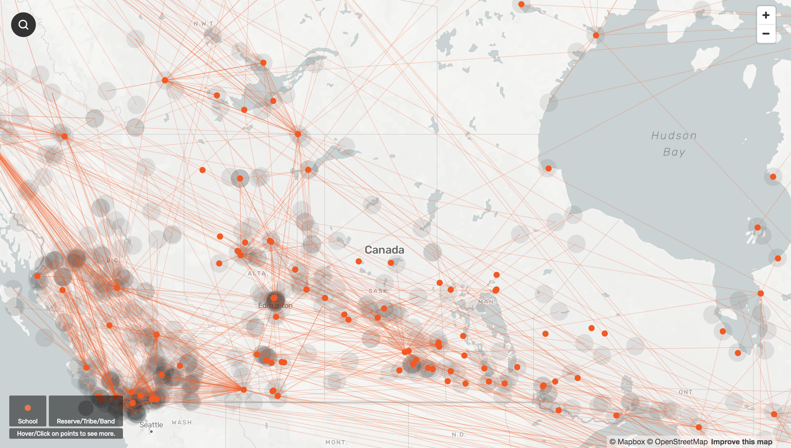
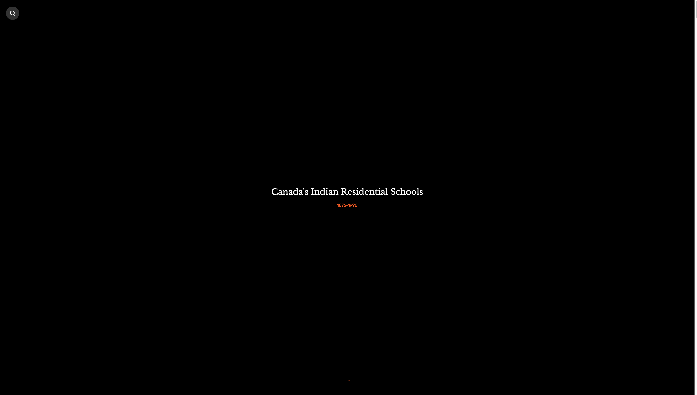
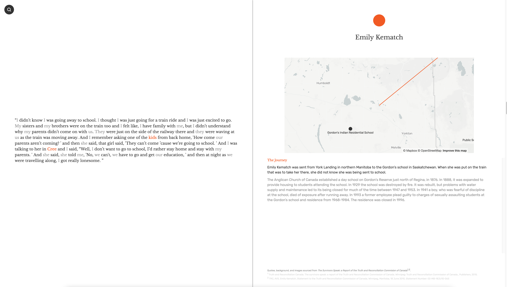
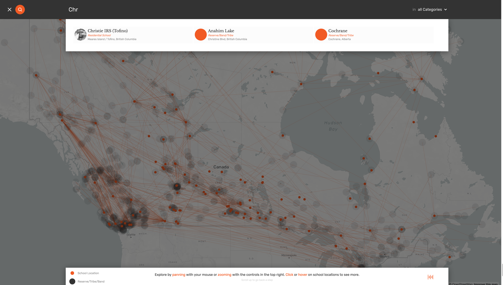

# Visualizing Canada's Indian Residential School System

### This visualization looks at Canada's Indian Residential School system -- a network of boarding schools and federal hostels throughout Canada from the mid 1800s until 1996 -- through the stories of survivors and the narrative of each school.

### Abstract
Canada's Indian Residential School System was a network of boarding schools, industrial schools, and federal hostels created to remove indigenous children from their homes and families. While many schools originated long before Confederation in 1867, the Indian Residential School System was primarily active following the approval of the Indian Act in 1876 — a group of laws aiming to do away with the Indian tribal system and forcibly enfranchise First Nations peoples -- until the the last federally-operated school closed in 1996.

Overall, there were 130 schools, as recognized by the National Truth and Reconciliation Commission and not including various Metis and Inuit institutions, in which roughly 150,000 native children were placed. They were located throughout every Canadian province except Prince Edward Island, Newfoundland, and New Brunswick. The schools were funded by the Canadian Government and operated by various religious groups.

In recent years and in light of official apologies issued by the Government of Canada, individual provinces and territories, the Vatican, and church groups, information about the schools and their students' welfare has become public knowledge: physical and sexual abuse was common, both between students and involving administrators; malnourishment and poor living conditions were typical; and assimilation, deprivation of cultural traditions, and punishment was the standard. It is estimated that 6000 children died while in attendance.

This project aims to investigate the IRS system visually, beginning with the stories of survivors and transitioning into the narrative of each school, it's student demographics, policies, everyday life, and management. What follows is a selection of survivor stories, as gathered by the National Truth and Reconciliation Commission between 2008 and 2015.

[Treatment - In Progress (Markdown)](https://github.com/svickars/thesis/blob/master/writing/07_treatment.md)

### Features
* Scroll through immersive survivor stories, told through direct quotes, with accompanying contextual information
* Interact (pan, zoom, and click) with a full screen map, layered in steps with school locations, reservation locations, and the connections between
* Click on a school location to view fully interactive school narrative and demographic data when available
* Search for stories, reserves/tribes/bands, stories, or locations with autocomplete and best match

### Credits
Created by Sam Vickars with data from the following sources:

* Truth and Reconciliation Canada. *The survivors speak: a report of the Truth and Reconciliation Commission of Canada*. Winnipeg: Truth and Reconciliation Commission of Canada., Publishers, 2015.
* The National Centre for Truth and Reconciliation at the University of Manitoba. Retrieved from [http://nctr.ca/](http://nctr.ca/)
* Howe, D. C. (2015). RiTa [Computer software]. Retrieved from [http://rednoise.org/rita](http://rednoise.org/rita)

### Featured images

#### Exercise One
* [Concept Development](https://github.com/svickars/thesis/blob/master/writing/02_conceptDevelopment.md)

#### Exercise Two
* [Introduction - Draft (Markdown)](https://github.com/svickars/thesis/tree/master/writing/06_introduction.md)
* [Introduction - Draft (PDF)](https://github.com/svickars/thesis/blob/master/writing/06_introduction.pdf)
* [Sketches](https://github.com/svickars/thesis/tree/master/visualization/sketch)

#### Exercise Three
* [Treament - Draft (Markdown)](https://github.com/svickars/thesis/blob/master/writing/07_treatment.md)
* [Prototype - Ongoing Draft](https://svickars.github.io/thesis/visualization/irs/index.html)

#### Feature Complete (April 25)
* [Features Presentation](https://github.com/svickars/thesis/blob/master/visualization/sketch/04_features.pdf)
* [Working Prototype (~50%)](https://svickars.github.io/thesis/visualization/irs/index.html)

- Explore qualitative data and personal stories of residential school survivors
- Explore interactive map showing residential schools, First Nations reservations, and the connections and movement between them
- Show data from individual school reports in a narrative format, combining timeline format (qualitative data) with quantitative data
- Search for specific story, school, or reservation

- Make hard-to-access NTRC and NCTR data available to all Canadians; provide a home for IRS data outside of government databases
- Understand the IRS system through the stories of the survivors and of a single school

- Available on desktop and tablet format, in story and research modes, allowing for both a narrated presentation and research on specific survivors and schools
- Also available in print format -->
